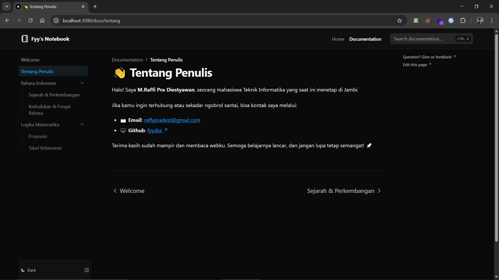

# 📚 Buku Kampus

**Buku Kampus** adalah situs dokumentasi pribadi ("Digital Garden") yang dibangun untuk menyimpan catatan belajar, materi kuliah, dan dokumentasi teknis. Proyek ini dirancang dengan fokus pada kecepatan, kemudahan penulisan konten (MDX), dan tampilan yang modern.



## 🚀 Technology Used

Proyek ini dibangun menggunakan _tech stack_ terbaru (Next.js 16 & Tailwind v4):

- **Framework:** [Next.js 16](https://nextjs.org/) (App Router)
- **Dokumentasi:** [Nextra 4.6](https://nextra.site/)
- **Bahasa:** [TypeScript](https://www.typescriptlang.org/)
- **Styling:** [Tailwind CSS 4](https://tailwindcss.com/) & `tw-animate-css`
- **Search Engine:** [Pagefind](https://pagefind.app/) (Static search)
- **Optimasi:** React Compiler & Turbopack enabled

## ✨ Features

- 📝 **Penulisan MDX:** Menulis konten semudah menulis Markdown dengan dukungan komponen React.
- 🌓 **Dark Mode:** Dukungan tema gelap/terang bawaan (via `next-themes`).
- ⚡ **Performa Tinggi:** Menggunakan Next.js App Router dengan Turbopack sebagai bundler.
- 🔍 **Pencarian Cepat:** Indeksasi konten statis menggunakan Pagefind saat _build_.
- 📱 **Responsif:** Tampilan antarmuka yang ramah.

## 🛠️ Installation

Required: nodejs & pnpm

1. **Clone repository**
   ```bash
   git clone https://github.com/fyydsz/bukukampus.git
   cd bukukampus
   ```
2. Instal dependency menggunakan pnpm sebagai package manager.
   ```
   pnpm install
   ```
3. Jalankan server
   ```
   pnpm dev
   ```
   Buka http://localhost:3000 di browser

## 📂 App Structure
```
.
├── app/
│   ├── _components/           # Komponen internal aplikasi
│   │   └── footer/            # Footer component
│   ├── docs/                  # 📝 Dokumentasi & Materi (MDX)
│   │   ├── bahasa_indonesia/
│   │   ├── dasar_pemrograman_python/
│   │   ├── kalkulus/
│   │   ├── kontribusi/
│   │   ├── logika_matematika/
│   │   ├── tentang/
│   │   └── page.mdx           # Halaman utama docs
│   ├── support/               # Halaman support/donasi
│   ├── _meta.global.tsx       # Konfigurasi navigasi/sidebar global
│   ├── globals.css            # Global styles & Stranger Things theme
│   ├── layout.tsx             # Root layout dengan Nextra
│   ├── page.tsx               # Landing page
│   └── not-found.tsx          # 404 page
├── components/                # Reusable components
│   ├── last-updated.tsx       # Last updated timestamp
│   ├── latex.tsx              # LaTeX rendering
│   └── theme-toggle.tsx       # Dark/Light mode toggle
├── public/                    # Aset statis (gambar, icon)
├── scripts/                   # Build scripts (pagefind, etc)
├── next.config.ts             # Konfigurasi Next.js & Nextra
└── package.json
```

## 📄 License
Project ini dilisensikan di bawah [Creative Commons Attribution-ShareAlike 4.0 International (CC BY-SA 4.0)](https://creativecommons.org/licenses/by-sa/4.0/).
